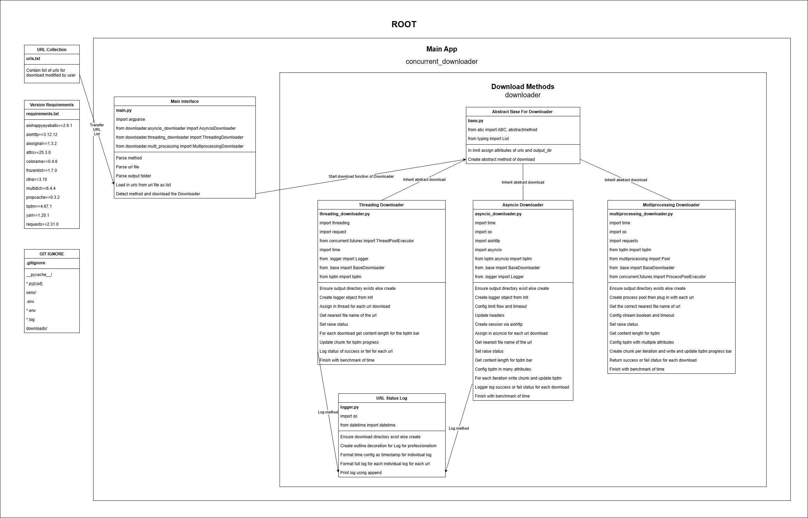

# Concurrency-Project-2-CLI-Concurrent-Downloader-With-Improvements-On-Features-and-Benchmarks
This is the 2nd project in final projects of concurrency, for project 1 I already made a CLI (Command-Line Interface) concurrent downloader to download multiple websites concurrently using command lines in the terminal. Check benchmark_documents for more info of my benchmark and analysis. Scroll to near the bottom to see how to use this.

In this 2nd project, i reconstructed the project 1 all from scratch all from my understanding and memory, no help from AI code or other source code, just full understanding and memory from project 1 and in this 2nd project I also fix edge cases, potential bugs, and improvements such as:

1/ Adding timeout to prevent waiting for ever.

2/ Separate the log.txt to different folder to avoid naming confusion in the downloads folder.

3/ Add try accept to handle all possible errors gracefully.

4/ Add a method named "mix" which is basically all three model respectfully multiprocessing, threading, and asyncio and all of them are submitted in ThreadPoolExecutor to run concurrently. This method is a fun mix and worth benchmarking along with other ones for better behavior recognition among different benchmarks.

5/ Add log recorded how many successful/fail file after downloading in terminal for asyncio and threading. Unfortunately its not applied for multiprocessing since its not process safe.

6/ Added renaming logic in downloaded files to prevent overwriting existing files which leads to incorrect results, so basically i added in a while loop which will check for existing file name, if its already existed that file name then the counter goes up until not then the counter number will be added to the name to make it unique to avoid overwriting if its the same name.

7/ Update the log in log.txt to shoutout the name of the method that called for the log for better clarification through passing parameter of method name to the logger.py

8/ Added Lock() for both threading and asyncio to avoid race condition when updating successful/fail count of downloads as well as calling log action for log.txt

In this downloader I coded all threading, asyncio, multiprocessing, and mix models then benchmark them based on total time run and its successful downloads then rank them based on successful file downloaded per second and analyze them.

Btw there are logs for threading and asyncio downloads, but unfortunately there is no log for multiprocessing approach because its not process safe.

You can refer to my old version of CLI concurrent downloader here:

https://github.com/WillyPhan06/Concurrency-Project-CLI-Concurrent-Downloader

Here is link to my Software Architect and DevSecOps Engineer road map:

https://github.com/WillyPhan06/Software-Architect-and-DevSecOps-Engineer-Road-Map

Here is high-level architecture diagram for both of my Project 1 and Project 2 of CLI Concurrent Downloader:

**📘 HOW TO USE - Concurrent Downloader CLI Tool**
This project allows you to download multiple files concurrently using threading, asyncio, or multiprocessing in Python.

**✅ Requirements**

Python 3.10+

**Visual Studio Code (VS Code) is recommended**

**🧠 Step-by-Step Instructions**

**🔧 Step 0: Clone the Repository**

_Open VS Code_
_Press Ctrl + ~ to open the terminal_

_Navigate to a folder where you want to store the project:_
cd path/to/your/folder

_Clone the repo:_
git clone https://github.com/WillyPhan06/Concurrency-Project-CLI-Concurrent-Downloader

_Navigate into the project folder:_
cd Concurrency-Project-CLI-Concurrent-Downloader

**🐍 Step 1: Set Up Virtual Environment**

_Run the following command to create a virtual environment:_
python -m venv venv

_Activate the virtual environment:_

_On Windows (CMD):_
venv\Scripts\activate

_On Windows PowerShell (recommended if you are using terminal of VSCode in Window):_
.\venv\Scripts\Activate.ps1

_On Mac/Linux:_
source venv/bin/activate

_Install dependencies (if any are added in future):_
pip install -r requirements.txt

**🌐 Step 2: Edit urls.txt**

_Open urls.txt in VS Code._
_Add one URL per line that you want to download content from._

_Example:_
https://example.com/file1.jpg
https://example.com/file2.jpg

**📥 Step 3: Run the Downloader**
_Make sure you're in the main project folder (Concurrency-Project-CLI-Concurrent-Downloader)._

_Choose one of the following methods:_

_▶️ Download using Threading:_
python concurrent_downloader/main.py --method threading --url-file urls.txt --output-dir downloads

_▶️ Download using Asyncio:_
python concurrent_downloader/main.py --method asyncio --url-file urls.txt --output-dir downloads

_▶️ Download using Multiprocessing:_
python concurrent_downloader/main.py --method multiprocessing --url-file urls.txt --output-dir downloads

**⏳ Step 4: Wait for Completion**

_The terminal will show a "Done" message along with the total time taken._

_Progress and status will be printed while downloading._

**📁 Step 5: Check Your Downloads**

_All downloaded files will be saved inside the downloads/ folder._

_If you used threading or asyncio, a log.txt file will also be generated inside downloads/, containing detailed logs of the download process._

**💡 Tips**

_Make sure the URLs in urls.txt are valid and accessible._

_To restart, just clear downloads/ and re-run a method._
